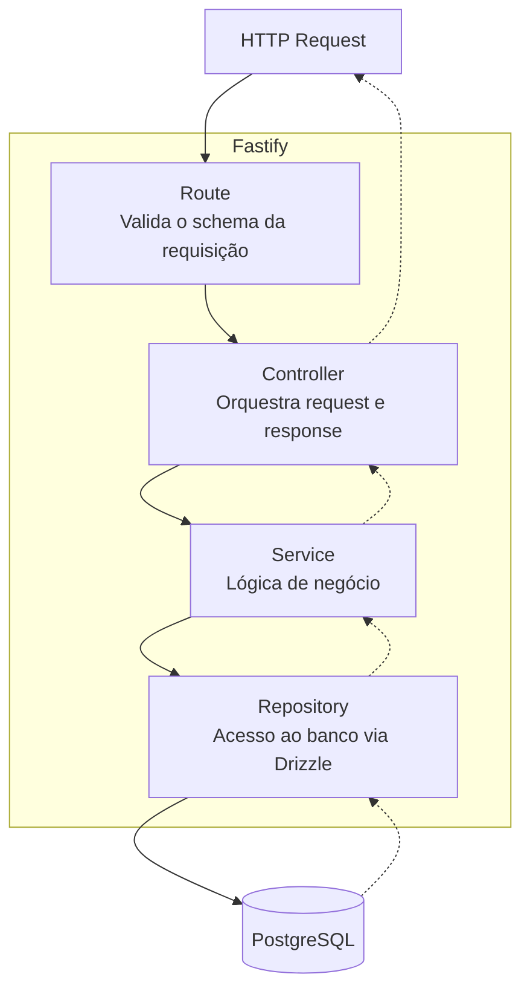
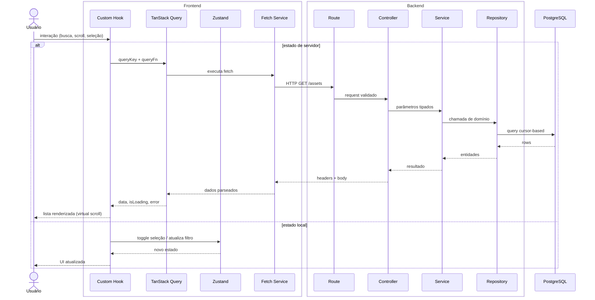

# ARCHITECTURE.md — Ledger Manager

Documento de decisões arquiteturais. Cada decisão registra o que foi escolhido, por que, e o que foi descartado. Serve de referência para todas as fases de desenvolvimento.

---

## Índice

1. [Camadas da API](#1-camadas-da-api)
2. [Gerenciamento de estado no frontend](#2-gerenciamento-de-estado-no-frontend)
3. [Comunicação frontend → backend](#3-comunicação-frontend--backend)
4. [Contrato de dados](#4-contrato-de-dados)
5. [Tratamento de erros](#5-tratamento-de-erros)
6. [Estrutura de pastas](#6-estrutura-de-pastas)
7. [Diagrama de camadas da API](#7-diagrama-de-camadas-da-api)
8. [Diagrama de fluxo completo](#8-diagrama-de-fluxo-completo)
9. [Convenções de código](#9-convenções-de-código)

---

## 1. Camadas da API

**Decisão:** 4 camadas — Route → Controller → Service → Repository

| Camada | Responsabilidade | Conhece HTTP? | Conhece Drizzle? |
|---|---|---|---|
| Route | Registra o endpoint e o schema de validação | Sim | Não |
| Controller | Extrai parâmetros, chama o Service, monta a resposta | Sim | Não |
| Service | Lógica de negócio pura | Não | Não |
| Repository | Único ponto de acesso ao banco | Não | Sim |

**Por que:**
Cada camada tem um único motivo de mudança. Uma alteração no ORM afeta apenas o Repository. Uma mudança de regra de negócio afeta apenas o Service. Uma mudança no formato da resposta afeta apenas o Controller. Sem essa separação, qualquer mudança propaga por todo o código.

O Service não depende do Drizzle, o que permite testá-lo com um Repository falso — sem banco real.

**Descartado:**
- *3 camadas (Route → Service → DB)* — o Service fica acoplado ao Drizzle, impossibilitando testes unitários isolados.
- *2 camadas (Route → DB)* — lógica de negócio dentro da rota, sem nenhuma possibilidade de teste isolado.

---

## 2. Gerenciamento de estado no frontend

**Decisão:** três ferramentas com responsabilidades distintas e sem sobreposição.

### TanStack Query — estado de servidor

Gerencia qualquer dado que vem da API: lista de ativos, resultado de busca, detalhe de um ativo.

**Por que:** estado de servidor tem características que estado local não tem — pode estar desatualizado, pode falhar, precisa ser revalidado. TanStack Query resolve cache, deduplicação de requisições, retry e estados de loading/error de forma declarativa. Gerenciar isso manualmente com `useState` + `useEffect` gera código repetitivo e propenso a race conditions.

**Descartado:** fetch manual com `useState/useEffect` — funcional, mas reescreve o que TanStack Query já resolve.

---

### Zustand — estado global do cliente

Gerencia estado que vive só no cliente e é compartilhado entre múltiplos componentes: ativos selecionados, filtros ativos, estado do painel de detalhes.

**Por que:** a Context API do React re-renderiza todos os consumidores quando qualquer parte do contexto muda. Com 100k registros em memória, isso é inaceitável. Zustand usa seletores — cada componente assina apenas a fatia do estado que precisa e só re-renderiza quando ela muda.

A seleção de ativos é mantida em `Set<string>`, garantindo operações de verificação, adição e remoção em O(1).

**Descartado:**
- *Context API* — re-renderização em cascata inaceitável para o volume de dados do projeto.
- *Redux Toolkit* — overhead de configuração desnecessário para o escopo atual.

---

### Hooks customizados — composição e encapsulamento

Encapsulam lógica reutilizável que compõe TanStack Query e Zustand, ou isolam lógica de componente que não precisa ser global.

**Por que:** componentes são responsáveis por renderização. Lógica de debounce, gerenciamento de cursor e integração com TanStack Query não pertencem ao corpo de um componente — pertencem a hooks nomeados e reutilizáveis.

Hooks previstos: `useDebounce`, `useAssetSelection`, `useCursorPagination`.

**Descartado:** hooks customizados para tudo (sem Zustand e TanStack Query) — válido para estudo de fundamentos, mas implica reescrever cache, sincronização e estado global do zero.

---

## 3. Comunicação frontend → backend

**Decisão:** funções de fetch puras em `services/`, consumidas pelo TanStack Query.

**Por que:** as funções de fetch são agnósticas ao React — podem ser usadas em Server Components, em testes ou em outros contextos fora do TanStack Query. Se o fetch estivesse inline no hook, seria código não reutilizável preso dentro do React.

**Descartado:**
- *Axios* — a Fetch API nativa cobre todos os casos deste projeto sem dependência adicional.
- *tRPC* — exige que frontend e backend compartilhem código. A arquitetura atual mantém os dois como serviços independentes. Descartado para preservar essa fronteira.

---

## 4. Contrato de dados

**Decisão:** metadata de paginação via headers HTTP, body contém apenas os dados.

| Header | Valor |
|---|---|
| `X-Total-Count` | Total de registros que satisfazem o filtro |
| `Link` | URL da próxima página com o cursor — padrão RFC 8288 |

**Por que:** o body contém o recurso solicitado. Metadados de paginação não são parte do recurso — são informações sobre a resposta. Colocá-los no body mistura responsabilidades. O cabeçalho `Link` é o mesmo padrão adotado pela API do GitHub.

**Descartado:** envelope no body `{ data, nextCursor, total }` — mais explícito, mas mistura dados com metadados no mesmo nível.

---

### Formato de erro

Todos os erros seguem o mesmo contrato, independente de onde foram lançados:

| Campo | Descrição |
|---|---|
| `error` | Mensagem legível por humanos |
| `code` | Identificador em `SCREAMING_SNAKE_CASE` para tratamento programático |
| `requestId` | ID da requisição para rastreamento em logs |

---

### Parâmetros de requisição

| Parâmetro | Tipo | Descrição |
|---|---|---|
| `cursor` | `string (uuid)` | ID do último registro da página anterior |
| `limit` | `number` | Registros por página — default 50, máximo 100 |
| `search` | `string` | Termo de busca via índice GIN |
| `type` | `string` | Filtro por tipo de ativo |
| `status` | `string` | Filtro por status |

---

## 5. Tratamento de erros

**Decisão:** error handler global no Fastify + Error Boundary no frontend + estados nativos do TanStack Query.

**Na API:** um único handler intercepta todos os erros não tratados, garante o formato padronizado na resposta e registra o log com `requestId`. Sem ele, cada rota trataria seus erros de forma independente, gerando inconsistência no contrato.

**No frontend:** TanStack Query expõe o estado de erro diretamente no hook — o componente reage sem lógica adicional. Para erros de renderização (bugs em componentes), um Error Boundary envolve as seções críticas e exibe um fallback sem quebrar a aplicação inteira.

**Descartado:**
- *try/catch em cada rota* — duplicação e risco de inconsistência no formato de erro entre rotas.
- *Tratamento de erros de fetch em cada componente* — desnecessário com TanStack Query expondo o estado de erro no hook.

---

## 6. Estrutura de pastas

### Backend

```
apps/api/src/
├── index.ts
├── plugins/
│   ├── cors.ts
│   └── error-handler.ts
├── routes/
├── controllers/
├── services/
├── repositories/
└── db/
    ├── index.ts
    └── schema.ts
```

### Frontend

```
apps/web/src/
├── app/
├── components/
├── hooks/
├── services/
└── store/
```

---

## 7. Diagrama de camadas da API
Link: https://mermaid.ai/d/ed2fc4d3-d76d-4085-bfd2-41c31fce31cd



---

## 8. Diagrama de fluxo completo

Do usuário até a resposta renderizada, atravessando as três camadas da stack.
Link: https://mermaid.ai/d/a7d728d5-0a3c-4c54-b8cb-03b52fb6fce2



---

## 9. Convenções de código

### Nomenclatura de arquivos

| Tipo | Padrão |
|---|---|
| Route | `[recurso].route.ts` |
| Controller | `[recurso].controller.ts` |
| Service | `[recurso].service.ts` |
| Repository | `[recurso].repository.ts` |
| Hook | `use[Nome].ts` |
| Store Zustand | `[nome].store.ts` |
| Componente React | `PascalCase/index.tsx` |

### Nomenclatura de símbolos

| Tipo | Padrão |
|---|---|
| Variáveis e funções | `camelCase` |
| Tipos e interfaces | `PascalCase` |
| Constantes e códigos de erro | `SCREAMING_SNAKE_CASE` |

### Variáveis de ambiente

Acessadas em um único módulo de configuração por app — nunca diretamente via `process.env` em serviços ou componentes. Isso centraliza a validação e evita falhas silenciosas por variável ausente.
